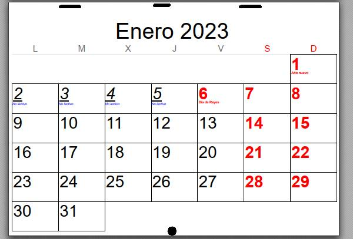

# Kitchen Calendar
Kitchen calendar template to hang on the wall. It prints on an A4 and it uses stranskyjan's
[photo-calendar library](https://github.com/stranskyjan/photo-calendar). So you will have to install it through:

`pip install photo-calendar`

and the library to manipulate html documents

`pip install dominate`

Once printed, just staple at the top and punch a hole at the bottom to be able to hang through the hole. Turn the title page up and hang it through he hole. You can punch two holes for better stability.

The template does not have pictures. Just tell your children to paint or glue their drawings on the back side of each month ;-)

The configuration files are in the data folder. The html file can easily be saved as pdf using Chrome.